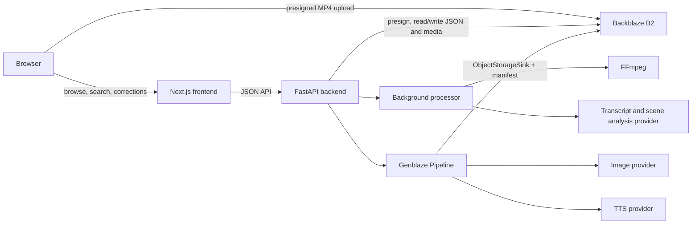

# AARchive architecture



## Runtime boundaries

- The frontend contains no provider or B2 credentials. It loads application data through FastAPI and media through short-lived URLs when the bucket is private.
- FastAPI owns validation, signing, metadata access, search, corrections, processing orchestration, and safe provenance responses.
- B2 is the durable system of record. Project, transcript, scene, correction, log, and brief JSON objects are read from B2; local disk is temporary workspace only.
- The processing worker downloads a source object to a temporary directory, extracts audio/frames with FFmpeg, calls configured AI services, uploads results, and removes the directory in `finally` cleanup.
- Genblaze runs two real media pipelines for a brief (cover image and narration), using a hierarchical B2 sink. A normalized `brief.json` points to Genblaze assets and exposes the canonical manifest hash.

## Search and verification

Search is deterministic and demo-safe: corrected scene metadata overrides original AI fields, then token/phrase/tag scoring ranks scenes. An embeddings provider can be enabled behind the same service contract. Corrections remain separate in `corrections.json`.

## B2 object layout

```text
projects/{project_id}/
  source/original.mp4
  audio/extracted.wav
  frames/frame-0001.jpg
  metadata/project.json
  metadata/transcript.json
  metadata/scenes.json
  metadata/corrections.json
  metadata/processing-log.json
  briefs/{brief_id}/brief.json
  briefs/{brief_id}/cover.png
  briefs/{brief_id}/narration.mp3
  briefs/{brief_id}/manifest.json
```
