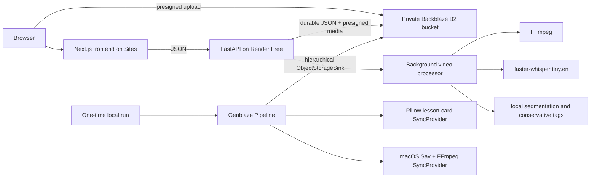

# AARchive architecture



## Runtime boundaries

- The frontend contains no provider or B2 credentials. It loads application JSON through FastAPI and receives short-lived media URLs.
- FastAPI owns validation, presigning, metadata access, search, corrections, cached-brief lookup, and safe provenance responses.
- B2 is the durable system of record. Local disk is temporary processing or generation workspace only.
- The processor downloads the source into a temporary directory, uses FFmpeg and faster-whisper, uploads all outputs, and removes the directory in `finally` cleanup.
- The successful brief media was created once by a real two-step Genblaze Pipeline and persisted with the Backblaze-compatible storage sink.
- `brief.json` keeps durable credential-free B2 object URLs. API responses replace those with one-hour presigned URLs for the private bucket.

## Search and verification

Corrected scene metadata overrides original machine fields before deterministic phrase/token/tag scoring. Corrections remain separate in `corrections.json`; the original `scenes.json` is preserved.

## Generated-media provenance

Successful run `b41e0cca-332b-4259-be84-c0518be665dd` contains a PNG, MP3, and canonical manifest. The brief stores provider/model identifiers, asset SHA-256 values, manifest URI and hash, and verification status. Two earlier NVIDIA image failures remain as failed manifests and are never presented as successful media.

## B2 object layout

```text
projects/{project_id}/
  source/original.mp4
  audio/extracted.wav
  frames/frame-0001.jpg
  metadata/project.json
  metadata/transcript.json
  metadata/scenes.json
  metadata/corrections.json
  metadata/processing-log.json
  briefs/{brief_id}/brief.json
  briefs/{brief_id}/genblaze/runs/{date}/{run_id}/
    assets/{asset_id}.png
    assets/{asset_id}.mp3
    manifest.json
```
