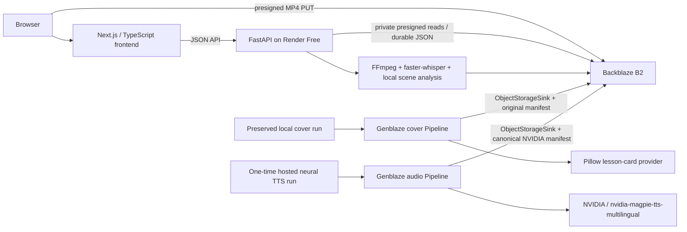

# AARchive

**Turn training footage into searchable lessons.**

AARchive turns public, synthetic, reenacted, or user-created training footage into searchable timestamped observations and reusable after-action training briefs.

- Public app: [aarchive-lessons.space-girl-in-love.chatgpt.site](https://aarchive-lessons.space-girl-in-love.chatgpt.site/)
- FastAPI backend: [aarchive-api.onrender.com](https://aarchive-api.onrender.com/health)
- Public repository: [github.com/MarieChantal1998/AARchive](https://github.com/MarieChantal1998/AARchive)

This is a two-day hackathon prototype. It is not approved by, affiliated with, or deployed by the Department of Defense or I/ITSEC. It is not designed for classified or sensitive operational data.

## Product overview

Training teams can accumulate hours of useful exercise footage while remaining unable to retrieve a specific moment without already knowing its filename and timestamp. AARchive makes footage addressable: upload an MP4, extract timestamped evidence, search in ordinary language, verify scene observations, and assemble selected moments into a narrated brief linked to source timestamps.

The public app includes both an unchanged seeded demonstration and a real processed synthetic exercise stored in Backblaze B2. The real project can be searched, opened at `16.84` seconds, corrected, and linked to a previously generated B2-hosted brief.

## Verified deployment status

| Capability | Verified state | Evidence |
|---|---|---|
| Frontend | Publicly deployed | OpenAI Sites URL above |
| Backend | Publicly deployed on Render Free | `/health` reports B2 connected |
| GitHub | Public and pushed | `master`, latest repository URL above |
| Video workflow | End-to-end verified | Synthetic MP4, audio, frames, transcript, scenes, logs in B2 |
| Search and seeking | End-to-end verified | Corrected `scene-002`, `16.84–34.64`, seeks to `16.84` |
| Human correction | End-to-end verified | Separate B2 correction overrides the machine observation |
| Genblaze AI media | End-to-end verified | NVIDIA narration run `57dd1528-8e44-4654-bb9d-688f57c067c1` |
| Generated cover | Connected to real B2 | Retained 59,055-byte Pillow PNG; original SHA-256 verified |
| AI-generated narration | End-to-end verified | Hosted NVIDIA Magpie WAV, 19.50 seconds and 1,720,364 bytes; SHA-256 verified |
| Provenance | End-to-end verified | Canonical NVIDIA-run hash `6ba1be1de298ce6039aa2cd28cc944e9e4fd52e707b25a823d5665841b89a2cf` |
| Public regeneration | Disabled | Backend remains `cached_only` |

No paid service, card, automatic billing, or automatic reload was activated.

## Architecture



See [ARCHITECTURE.md](ARCHITECTURE.md) for boundaries and object layout.

## User workflow

1. Open the library or upload an authorized MP4 directly to B2 with a presigned URL.
2. Process the footage with FFmpeg, local Whisper transcription, timestamp segmentation, and conservative machine observations.
3. Search transcript text, summaries, tags, and human-corrected fields.
4. Choose **Open moment** to seek the source video to the result’s `start_seconds`.
5. Mark an observation accurate or needing correction; corrections remain separate and take precedence.
6. Select scenes and open the cached after-action brief.
7. Review the retained cover, 19.50-second NVIDIA neural narration, timestamps, provider/model fields, hashes, and provenance.

## Backblaze B2 usage

B2 is the durable system of record, not a backup. The public library reads real project JSON from B2. Source video, extracted audio, frames, transcript, scenes, corrections, processing logs, brief JSON, generated media, and Genblaze manifests all live under the project prefix. Source uploads use presigned direct PUTs; private video and brief assets are returned through short-lived presigned GET URLs.

Verified bucket: `aarchive-nyirachantal1998-media`. The workflow remains well within Backblaze’s included 10 GB allowance.

## Genblaze usage

The public brief now contains genuine hosted neural AI audio generated by **NVIDIA / `nvidia/magpie-tts-multilingual`**. A compatibility subclass of the official `genblaze-nvidia==0.3.3` `NvidiaAudioProvider` uses NVIDIA’s documented hosted Riva HTTP transport while retaining Genblaze’s real `Pipeline`, provider, asset, and manifest contracts.

- A 67-character validation sentence ran once after a live `list_voices` preflight.
- Only after that succeeded, a single 330-character after-action narration ran through `Pipeline("aarchive-nvidia-magpie-narration")` with voice `Magpie-Multilingual.EN-US.Aria`.
- The full run used `max_retries=0`; the validation and full-start markers in B2 prevent a restart from repeating either synthesis request.
- `S3StorageBackend.for_backblaze(...)`, `ObjectStorageSink`, and `KeyStrategy.HIERARCHICAL` persisted the WAV and canonical provenance manifest to the private B2 bucket.
- Run `57dd1528-8e44-4654-bb9d-688f57c067c1` produced a 19.50-second WAV with SHA-256 `445864cf0f236ff6177e970671f2db49bf2df6ff9b5f9e130d224c4aec41f874`.
- The B2 manifest verifies canonically with hash `6ba1be1de298ce6039aa2cd28cc944e9e4fd52e707b25a823d5665841b89a2cf`.
- Public generation is back to `cached_only`; replaying the narration uses a signed B2 URL and cannot trigger inference.

The professional cover remains the verified Pillow `pillow-lesson-card-v1` asset from the earlier local two-step Genblaze run. Its original asset and manifest were not overwritten, and the pre-NVIDIA `brief.json` is preserved as `brief.local-fallback.json`. Pillow is not presented as the project’s evidence of generative AI; the Magpie narration is.

The NVIDIA developer endpoint was used under its free API Trial access at a verified cost of $0, without a payment method, upgrade, auto-reload, or billable provider. Two earlier FLUX attempts failed truthfully with a read timeout and provider-side `504`; their failed manifests remain historical records and no NVIDIA-generated image is claimed. GMI Cloud and OpenAI integrations remain optional and disabled because no funded API service is available.

Official implementation references: [Genblaze repository](https://github.com/backblaze-labs/genblaze), [Backblaze Genblaze Developer Guide](https://www.backblaze.com/docs/cloud-storage-genblaze-developer-guide), [Genblaze on PyPI](https://pypi.org/project/genblaze/), and [NVIDIA Magpie TTS API](https://build.nvidia.com/nvidia/magpie-tts-multilingual/api).

## Providers and models actually used

| Purpose | Actual provider / model | Cost |
|---|---|---|
| Transcription | local `faster-whisper`, `tiny.en` | $0 |
| Scene structuring | deterministic local transcript segmentation and conservative tag analysis | $0 |
| Brief text | deterministic selected-scene assembly with human-correction precedence | $0 |
| Brief cover | Pillow `pillow-lesson-card-v1` through Genblaze | $0 |
| Narration | NVIDIA hosted neural TTS, `nvidia/magpie-tts-multilingual`, Aria voice, through Genblaze | $0 |
| Durable storage | Backblaze B2 S3-compatible API and Genblaze S3 sink | Free allowance |

Preserved fallback: macOS Say `macos-say-tts-v1`, Samantha at 155 wpm, encoded by FFmpeg. Optional disabled providers: GMI Cloud image/audio, NVIDIA NIM image generation, and OpenAI image/TTS. OpenAI is never selected unless `OPENAI_API_KEY` is present and funded billing is explicitly available.

## B2 object layout

```text
projects/{project_id}/
  source/original.mp4
  audio/extracted.wav
  frames/frame-0001.jpg
  metadata/project.json
  metadata/transcript.json
  metadata/scenes.json
  metadata/corrections.json
  metadata/processing-log.json
  briefs/{brief_id}/
    brief.json
    brief.local-fallback.json
    genblaze/runs/{date}/{run_id}/
      assets/{asset_id}.png
      assets/{asset_id}.mp3
      manifest.json
    genblaze-nvidia-narration/runs/{date}/{run_id}/
      assets/{asset_id}.wav
      manifest.json
    nvidia-tts-one-shot/
      validation-started.json
      validation-succeeded.json
      full-started.json
      completed.json
```

## How B2 and Genblaze Are Essential

B2 makes AARchive’s searchable library durable: removing it removes the real videos, timestamp metadata, corrections, generated media, and provenance. Genblaze turns the retained cover and NVIDIA neural narration into traceable media workflows: removing it removes the run manifests, canonical hashes, asset hashes, verification results, and hierarchical B2 persistence.

The successful cached brief is not a static file copied into the frontend. It is loaded from B2 through FastAPI, and its media URLs are presigned at response time because the bucket is private.

## Local setup

Requirements: Node 22.13+, Python 3.11+, and FFmpeg. The zero-cost local narration provider additionally requires macOS Say.

```bash
cp .env.example .env
npm install
python3 -m venv /tmp/aarchive-venv
source /tmp/aarchive-venv/bin/activate
pip install -e 'backend[dev]'
```

Run the services in separate terminals:

```bash
npm run dev
```

```bash
source /tmp/aarchive-venv/bin/activate
uvicorn aarchive.main:app --app-dir backend --reload --port 8000
```

Open `http://localhost:3000`; API documentation is at `http://localhost:8000/docs`.

## Environment variables

Server-only B2 settings:

- `B2_ENDPOINT_URL`, `B2_REGION`, `B2_BUCKET`, `B2_KEY_ID`, `B2_APP_KEY`
- `B2_PUBLIC_URL_BASE` only for an intentionally public bucket; omit it for presigned reads

Provider and processing settings:

- `TRANSCRIPTION_PROVIDER=local_whisper`, `LOCAL_WHISPER_MODEL=tiny.en`, `ANALYSIS_PROVIDER=local`
- `GENERATION_MODE=cached_only` in public deployments
- `LOCAL_IMAGE_MODEL`, `LOCAL_AUDIO_MODEL`, `LOCAL_TTS_VOICE`, `LOCAL_TTS_RATE`
- optional `GMI_API_KEY`, `NVIDIA_API_KEY`, or `OPENAI_API_KEY`; never expose these to the frontend
- `NVIDIA_TTS_ONE_SHOT_ENABLED=false` in normal and public operation; the verified demo run used the guarded B2 markers and was immediately returned to `false`

Deployment settings:

- `NEXT_PUBLIC_API_URL` is the only frontend-visible API setting
- `FRONTEND_ORIGINS`, `MAX_UPLOAD_MB`, `PROCESSING_TIMEOUT_SECONDS`, `GENERATION_TIMEOUT_SECONDS`

Never commit `.env` or place credentials in `NEXT_PUBLIC_*` values.

## Deployment

### Frontend

The frontend is deployed with OpenAI Sites from the project containing `.openai/hosting.json`. Its configured backend is `https://aarchive-api.onrender.com`.

```bash
npm run build
```

### Backend

`render.yaml` and `backend/Dockerfile` define the FastAPI service. The verified deployment uses Render’s free web-service plan, so an idle cold start may add roughly 50 seconds. No paid Render plan is required.

```bash
docker build -f backend/Dockerfile -t aarchive-api .
docker run --env-file .env -p 8000:8000 aarchive-api
```

Set secrets only in the host dashboard, add the Sites origin to `FRONTEND_ORIGINS`, and verify `/health` before connecting the frontend.

## Demo credentials

None. The public app and cached B2 brief require no judge-supplied API key. Public regeneration is disabled, so viewing or replaying the generated media does not trigger inference.

## Testing

Run frontend lint/build/tests and all backend tests:

```bash
npm run test:all
```

If the virtual environment is not activated:

```bash
AARCHIVE_PYTHON=/path/to/venv/bin/python npm run test:all
```

Verify a cached brief directly against B2 without printing credentials:

```bash
cd backend
python -m scripts.verify_cached_brief PROJECT_ID BRIEF_ID
```

Tests cover B2 keys, metadata validation, segmentation, ranking, timestamps, correction precedence, Genblaze abstractions, current NVIDIA TTS transport, local media generation, private-asset presigning, failure states, and credential leakage.

## Security limitations

- MP4 type/size validation, UUID identifiers, fixed object-key builders, direct B2 uploads, and temporary-directory cleanup are implemented.
- Provider and B2 credentials remain server-side. Private B2 assets use one-hour presigned response URLs.
- CORS is explicit; generation has timeouts and zero automatic retries.
- This prototype has no user authentication, malware scanning, tenant isolation, durable task queue, or complex role-based access control.
- It is not FedRAMP, CMMC, military, classified-data, or government-security compliant and makes no such claim.

## Public/synthetic-data disclaimer

Use only footage that is public, synthetic, reenacted, or user-created and authorized for upload. The seeded public-domain footage and real synthetic exercise do not imply government endorsement, affiliation, deployment, or approval. Machine observations may be incomplete or wrong and require qualified human review.

## Known limitations

- Search uses deterministic weighted terms and tags rather than embeddings.
- Processing runs as an in-process FastAPI background task instead of a durable queue.
- The successful $0 cover is a professionally composed lesson card, not a diffusion-model image.
- NVIDIA’s hosted Magpie UI limits text to 350 characters, so the one-call verified narration is 19.50 seconds rather than the initially targeted 45–90 seconds.
- The preserved offline narration fallback requires macOS; it is retained in B2 but is no longer the narration referenced by the public brief.
- The NVIDIA hosted FLUX trial returned a provider-side `504`, so no NVIDIA-generated image is claimed.
- Render Free can cold-start after inactivity.

## Future roadmap

- GMI Cloud media generation if hackathon credits become available
- Durable task queue and resumable multipart uploads
- Embeddings-based hybrid retrieval
- Scene-boundary vision analysis and reviewer edit history
- Authentication, tenant isolation, and malware scanning
- Brief export to PDF/Slides and signed provenance verification

## Submission materials

See [docs/submission.md](docs/submission.md) for the Devpost-ready description and three-minute demo outline.
