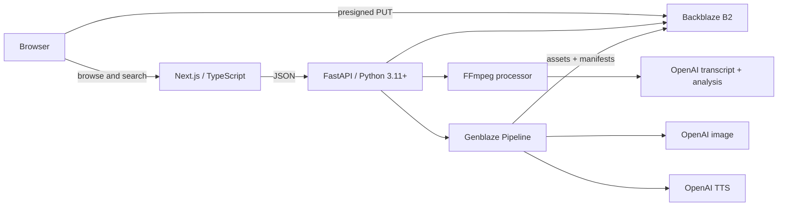

# AARchive

**Turn training footage into searchable lessons.**

AARchive turns unstructured public, synthetic, reenacted, or user-created training footage into searchable timestamped observations, then assembles selected moments into reusable after-action training briefs.

This is a two-day hackathon prototype. It is not approved by, affiliated with, or deployed by the Department of Defense or I/ITSEC. It is not designed for classified or sensitive operational data.

## Product overview

Training teams can accumulate hours of useful exercise footage while remaining unable to retrieve a specific moment without already knowing its filename and timestamp. AARchive makes the footage addressable: upload a video, extract timestamped evidence, search in ordinary language, verify scene observations, and generate a narrated brief that always points back to source moments.

The deployed frontend includes a public-domain, preprocessed emergency-response exercise so the workflow is immediately testable without cloud credentials or generation wait time. Synthetic secondary records demonstrate library and processing states; only the public demo opens as footage.

## Architecture



See [ARCHITECTURE.md](ARCHITECTURE.md) for boundaries and object layout.

## User workflow

1. Open the library and use the seeded search or enter a natural-language query.
2. Review ranked scene summaries, excerpts, tags, confidence, and timestamp ranges.
3. Choose **Open moment** to seek the source video to `start_seconds`.
4. Mark an observation accurate or needing correction; configured deployments persist a separate correction object.
5. Select scenes and open or generate an after-action brief.
6. Review the cover, narration, source timestamps, provider/model information, and safe provenance fields.

## Backblaze B2 usage

B2 is the application’s intended durable source of truth, not a backup. The API lists library records from project JSON objects, creates direct-upload presigned URLs, streams private media with short-lived URLs, reads corrected scene metadata for search, and stores all generated assets and manifests.

The repository also includes an explicit public-demo fallback because no B2 secret is embedded in a judge-facing frontend. With B2 configured, uploaded projects and generated briefs are read from the bucket.

## Genblaze usage

The backend uses the current official Genblaze package family available on August 1, 2026: umbrella `genblaze` 0.4.5 with `genblaze-core` 0.3.8, `genblaze-openai` 0.3.4, and `genblaze-s3` 0.3.6.

- `Pipeline` for both cover-image and narration runs;
- `DalleProvider` with `gpt-image-1`;
- `OpenAITTSProvider` with `gpt-4o-mini-tts`;
- `S3StorageBackend.for_backblaze(...)`;
- `ObjectStorageSink` with `KeyStrategy.HIERARCHICAL`;
- conservative `max_retries=1` and explicit timeouts;
- canonical manifest hashes, asset SHA-256 values, verification results, and manifest URIs captured in `brief.json`.

The live endpoint fails clearly when credentials or providers are unavailable and never substitutes a fake success. The seeded brief’s visual/audio are explicitly labeled as unverified demo assets; the UI does not claim they came from a verified Genblaze run.

Official references used for implementation: [Genblaze repository](https://github.com/backblaze-labs/genblaze), [Backblaze Genblaze Developer Guide](https://www.backblaze.com/docs/cloud-storage-genblaze-developer-guide), and [Genblaze on PyPI](https://pypi.org/project/genblaze/).

## Providers and models used

| Purpose | Provider / model | Path |
|---|---|---|
| Transcription | OpenAI `gpt-4o-mini-transcribe` | Processing service |
| Scene structuring | OpenAI `gpt-4.1-mini` | Processing service |
| Brief cover | OpenAI `gpt-image-1` | Genblaze `DalleProvider` |
| Narration | OpenAI `gpt-4o-mini-tts`, voice `coral` | Genblaze `OpenAITTSProvider` |
| Durable storage | Backblaze B2 S3-compatible API | boto3 + Genblaze storage sink |

Models are environment-configurable. Genblaze provider classes and method signatures are pinned to the version tested in `backend/pyproject.toml`.

## B2 object layout

```text
projects/{project_id}/
  source/original.mp4
  audio/extracted.wav
  frames/frame-0001.jpg
  metadata/project.json
  metadata/transcript.json
  metadata/scenes.json
  metadata/corrections.json
  metadata/processing-log.json
  briefs/{brief_id}/
    brief.json
    cover.png
    narration.mp3
    manifest.json
    genblaze/runs/{date}/{run_id}/...
```

## Local setup

Requirements: Node 22.13+, Python 3.11+, and FFmpeg.

```bash
cp .env.example .env
npm install
python3 -m venv /tmp/aarchive-venv
source /tmp/aarchive-venv/bin/activate
pip install -e 'backend[dev]'
```

Run the services in separate terminals:

```bash
npm run dev
```

```bash
source /tmp/aarchive-venv/bin/activate
uvicorn aarchive.main:app --app-dir backend --reload --port 8000
```

Open `http://localhost:3000`. API documentation is at `http://localhost:8000/docs`; health is at `/health`.

## Environment variables

Copy `.env.example`. Important server-only settings:

- `B2_ENDPOINT_URL`, `B2_REGION`, `B2_BUCKET`, `B2_KEY_ID`, `B2_APP_KEY`
- `B2_PUBLIC_URL_BASE` for an intentionally public bucket; omit it for presigned reads
- `OPENAI_API_KEY`
- `OPENAI_TRANSCRIPTION_MODEL`, `OPENAI_ANALYSIS_MODEL`, `OPENAI_IMAGE_MODEL`, `OPENAI_TTS_MODEL`, `OPENAI_TTS_VOICE`
- `FRONTEND_ORIGINS`, `MAX_UPLOAD_MB`, and processing/generation timeouts

Only `NEXT_PUBLIC_API_URL` is frontend-visible. Never expose storage or provider keys through a `NEXT_PUBLIC_` variable.

## Deployment

### Frontend

The repository includes `.openai/hosting.json` and is deployable with OpenAI Sites. The build is Cloudflare Worker-compatible.

```bash
npm run build
```

Set `NEXT_PUBLIC_API_URL` in the hosted frontend environment to the HTTPS backend origin.

### Backend

`render.yaml` and `backend/Dockerfile` define a deployable Python service. On Render, create a Blueprint from this repository and set all secret variables in the dashboard. Equivalent container services work with:

```bash
docker build -f backend/Dockerfile -t aarchive-api .
docker run --env-file .env -p 8000:8000 aarchive-api
```

Add the deployed frontend origin to `FRONTEND_ORIGINS`. Confirm `/health`, then set the frontend API URL and redeploy the frontend.

## Demo credentials

None. The seeded public-domain project and honest unverified demonstration brief require no login or API key. Upload, persisted corrections, processing, and live Genblaze generation activate only when server-side cloud credentials are configured.

## Testing

Run everything:

```bash
npm run test:all
```

Focused commands:

```bash
npm run lint
npm run test:frontend
npm run test:backend
```

Tests cover object keys, validation, transcript segmentation, ranking, timestamp formatting, human-correction precedence, the Genblaze boundary, explicit upload failure, and credential leakage.

## Security limitations

- MP4-only content/type and size validation, UUID identifiers, fixed object-key builders, and conservative upload limits are implemented.
- Source bytes go directly to B2 through presigned URLs; temporary processing directories are removed automatically.
- Provider and B2 credentials are server-side only. API responses expose an allowlist of non-secret capability/provenance fields.
- CORS is explicit. Provider calls have timeouts and one expensive-operation retry.
- This prototype has no authentication or complex role-based access control.
- It is not FedRAMP, CMMC, military, classified-data, or government-security compliant, and makes no such claim.
- Before production use, add authentication, malware scanning, background job infrastructure, signed webhooks, audit retention, and tenant isolation.

## Public/synthetic-data disclaimer

Use only footage that is public, synthetic, reenacted, or user-created and authorized for upload. The included demonstration video is public-domain U.S. government media redistributed by Wikimedia Commons/DVIDS; its presence does not imply endorsement, affiliation, deployment, or approval. AI observations may be incomplete or wrong and always require human verification.

## Known limitations

- Search uses deterministic weighted terms/tags in this stable MVP; an embeddings boundary can replace or augment it.
- Processing runs as an in-process FastAPI background task, suitable for a hackathon demo but not durable production queues.
- The deployed frontend can demonstrate the complete seeded flow without the backend; uploads and real generation require the separately deployed API and credentials.
- Seeded image/audio assets are not represented as Genblaze-verified. A real live generation run is required to populate hashes and verified manifests.
- Video-derived scene observations should be checked against the source before submission or reuse.

## Future roadmap

- Durable task queue and resumable multipart uploads
- Embeddings-based retrieval with hybrid keyword ranking
- Scene-boundary vision analysis and reviewer edit history
- Organization-safe authentication and per-project access
- Brief export to PDF/Slides and signed provenance verification
- Evaluation datasets for timestamp precision and correction quality

## How B2 and Genblaze Are Essential

B2 makes the library possible: large source videos, frames, transcripts, corrections, processing logs, generated media, and provenance objects share one durable address space. The product loads its durable project collection from those objects and uses presigned URLs so private media can remain private.

Genblaze makes the after-action brief a reproducible media pipeline instead of two unrelated API calls. It executes the supported image and TTS providers, transfers their outputs to B2, calculates asset hashes, writes canonical provenance manifests, and exposes verification results that AARchive can attach to each brief. Removing B2 removes the durable searchable library; removing Genblaze removes the verifiable generated-media workflow.

## Submission materials

See [docs/submission.md](docs/submission.md) for a Devpost-ready description and three-minute demo outline.
